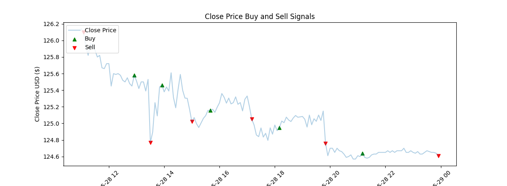

# Gaming-the-Markets
This program is a bot that backtests stock data fetched from the TDA Ameritrade

# Work in Progress

## Strategy
The Bot's strategy is defined by selecting indicators that signal when to buy or sell a security. Indicators are calculated by the program from data fetched from TD Ameritrade. A user may also select the amount of time to execute a trade. 
A strategy contains: indicators, time instructions, what option label, when to buy or put.
A strategy  is just this: a modified pandas dataframe that contains the labels for your new signal.

- A strategy contains takes some set of signals that define when to buy or sell.
- A strategy backtests and logs which positions were taken, and which were profitable.

## Bot
The Bot class implements the strategy. It can backtest the strategy on a Json dataframe. 

